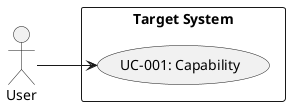
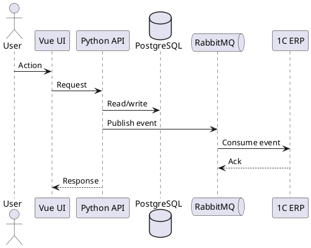

# Artifact Templates

Use these templates when emitting reviewable analyst artifacts from the canonical model.

## Requirements Catalog

| ID | Type | Requirement | Source | Priority | Owner | Status | Acceptance |
| --- | --- | --- | --- | --- | --- | --- | --- |
| FR-001 | functional |  | SRC-001 | must |  | draft | AC-001 |

## Open Questions

| ID | Level | Question | Context | Why It Matters | Owner | Blocks |
| --- | --- | --- | --- | --- | --- | --- |
| Q-001 | blocker |  |  |  |  | FR-001 |

## Traceability Matrix

| Source | Extracted Fact | Requirement | Artifact | Acceptance/Test |
| --- | --- | --- | --- | --- |
| SRC-001#p1 |  | FR-001 | BPMN-001 | AC-001 |

## Bitrix24 Task Tree

Use this shape for implementation planning:

| Task | Type | Description | Depends On | Acceptance Criteria | Assignee Role |
| --- | --- | --- | --- | --- | --- |
| 1 | Epic |  |  |  | Analyst |
| 1.1 | Backend |  | 1 | AC-001 | Python developer |
| 1.2 | Frontend |  | 1 | AC-002 | Vue developer |
| 1.3 | 1C ERP |  | 1 | AC-003 | 1C consultant |
| 1.4 | QA |  | 1.1, 1.2, 1.3 | AC-001..AC-003 | QA |

Each task should have an unambiguous outcome, dependencies, artifacts, and acceptance criteria. Avoid tasks named only "analyze", "develop", or "configure" without a concrete deliverable.

## BPMN Outline

Use for StormBPMN or textual BPMN preparation:

| Element ID | Type | Name | Actor/Lane | Incoming | Outgoing | Notes |
| --- | --- | --- | --- | --- | --- | --- |
| EVT-001 | start event |  |  |  | ACT-001 |  |
| ACT-001 | user task |  |  | EVT-001 | GW-001 |  |
| GW-001 | exclusive gateway |  |  | ACT-001 | ACT-002, ACT-003 |  |

Quality checks:

- Every process has exactly one clear start trigger unless the process is intentionally event-based.
- Gateways are named as decisions, not actions.
- Error and cancellation paths are visible.
- External systems are separate lanes or pools when the boundary matters.

## PlantUML Use Case



## PlantUML Sequence



## API Contract

| Field | Value |
| --- | --- |
| ID | API-001 |
| Operation |  |
| Method/Command |  |
| URL/Topic |  |
| Auth |  |
| Request |  |
| Response |  |
| Errors |  |
| Idempotency |  |
| Versioning |  |
| Source Requirements |  |

## RabbitMQ Message Contract

| Field | Value |
| --- | --- |
| ID | MSG-001 |
| Event Name |  |
| Producer |  |
| Consumer |  |
| Exchange |  |
| Routing Key |  |
| Queue |  |
| Payload Schema |  |
| Correlation ID |  |
| Idempotency Key |  |
| Retry Policy |  |
| Dead Letter Handling |  |
| Ordering Requirements |  |
| Duplicate Handling |  |
| Monitoring |  |

## Database Change

| ID | Object | Change | Reason | Constraints | Indexes | Migration Notes |
| --- | --- | --- | --- | --- | --- | --- |
| DB-001 | table.column |  | FR-001 |  |  |  |

## Acceptance Criteria

Use Gherkin when the scenario matters:

```gherkin
Scenario: AC-001 Short scenario name
  Given a defined precondition
  When the user or system performs an action
  Then the expected observable result occurs
```

Use a checklist when criteria are independent:

| ID | Requirement | Criterion | Evidence |
| --- | --- | --- | --- |
| AC-001 | FR-001 |  |  |
